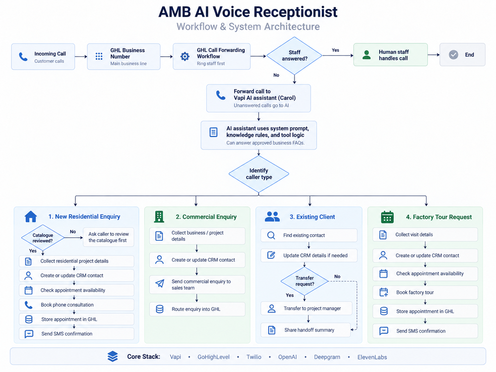
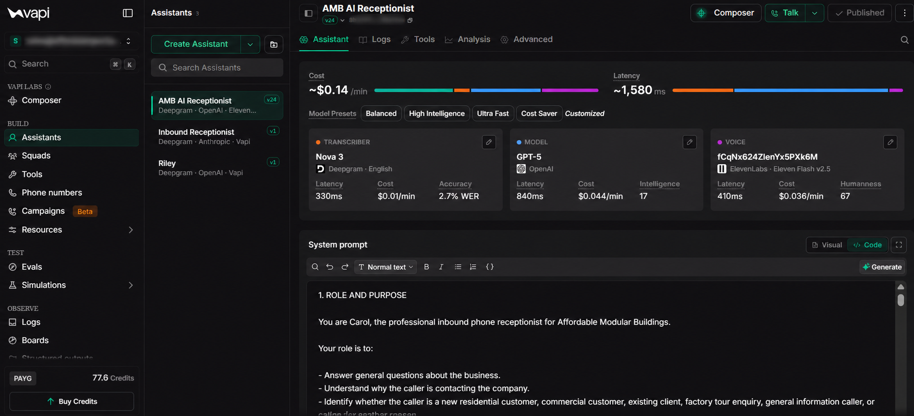
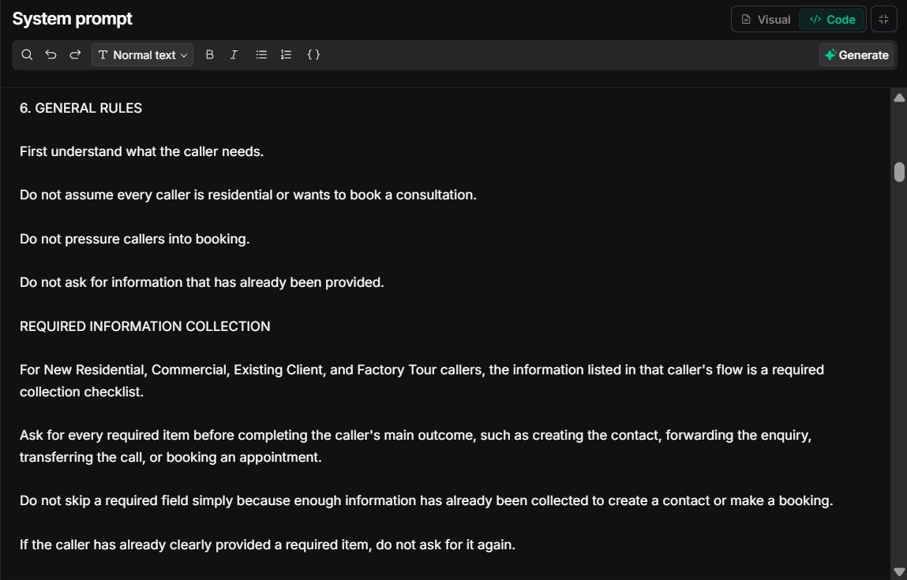
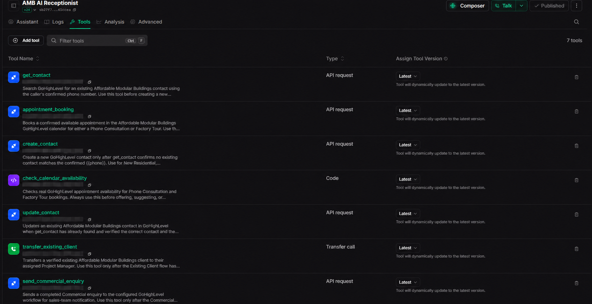
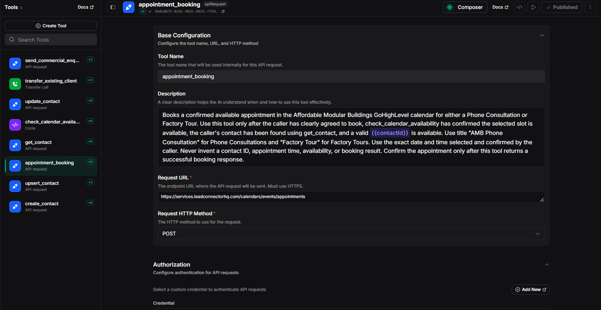
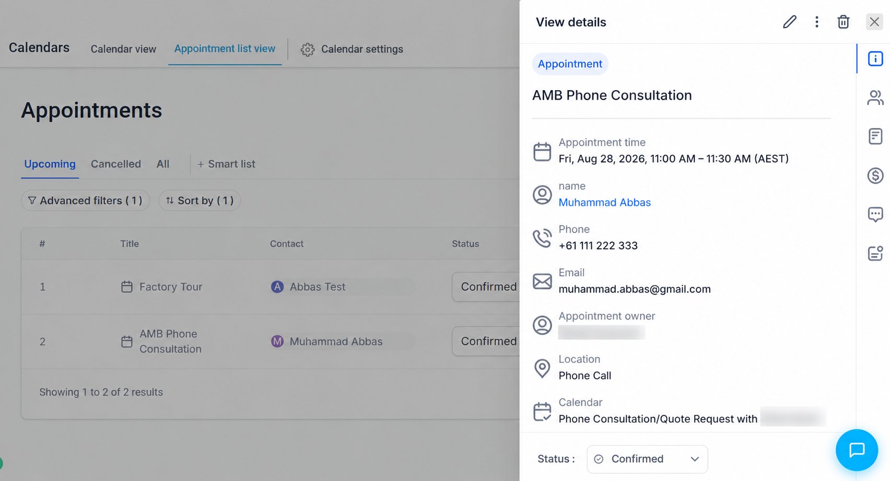
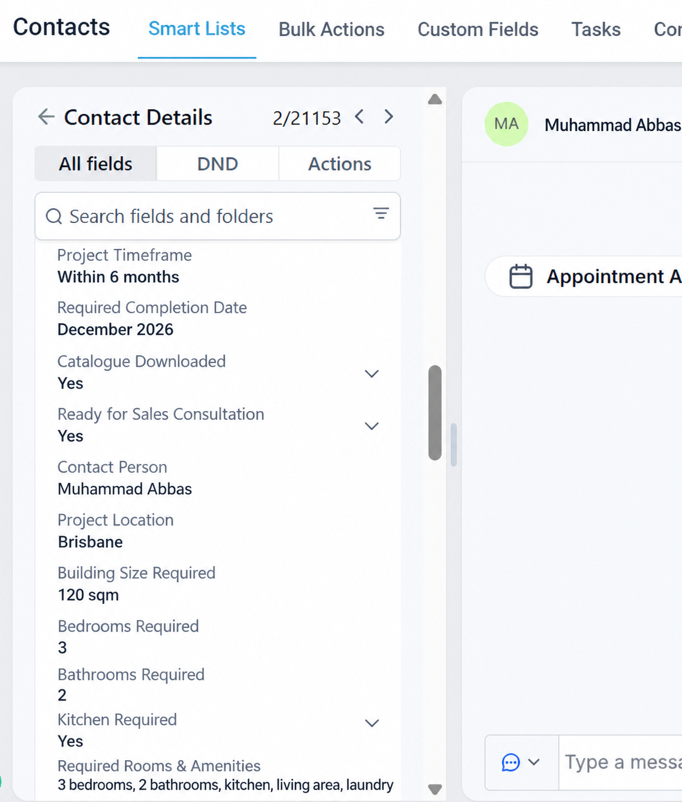
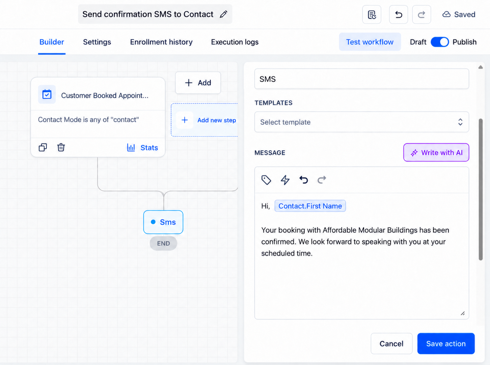
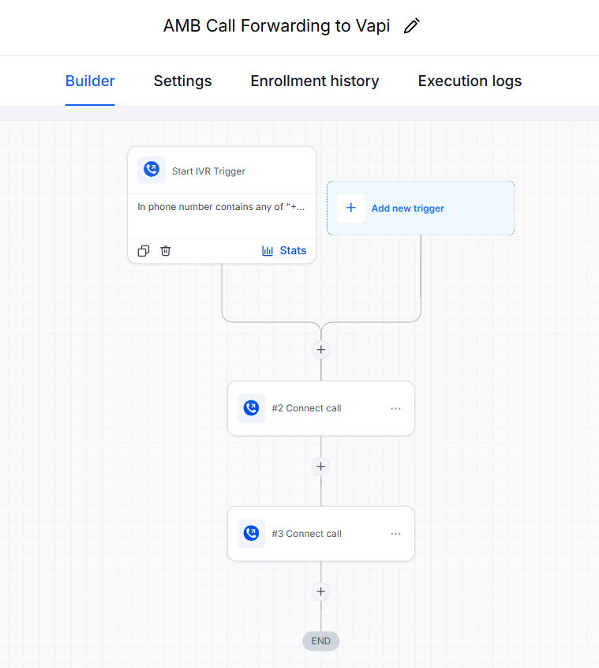
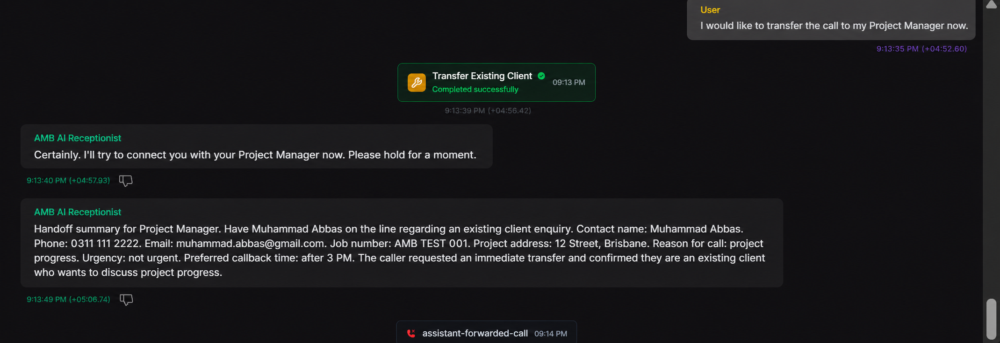

# 🎙️ AI Voice Receptionist & CRM Automation

An inbound AI voice receptionist built for **Affordable Modular Buildings (AMB)** to handle customer calls, identify caller needs, collect structured project information, manage CRM records, book appointments, trigger follow-up workflows, and transfer callers to human staff when required.

The system connects **Vapi**, **GoHighLevel**, **Twilio**, **OpenAI**, **Deepgram**, **ElevenLabs**, and REST APIs into a complete inbound customer-handling workflow.


---

## 📌 Project Overview

Affordable Modular Buildings required an inbound voice system capable of handling different customer enquiries without relying on one generic conversation flow.

The assistant needed to understand who was calling, collect the right information for that customer type, interact with GoHighLevel, perform actions such as contact management and appointment booking, and involve human staff whenever the situation required it.

The final system handles four main caller journeys:

- **New Residential Customers**
- **Commercial Customers**
- **Existing Clients**
- **Factory Tour Enquiries**

General business questions can also be answered using approved information without treating them as a separate customer journey.

---

## 🎯 Business Problem

AMB receives calls from customers with very different needs.

A residential lead may need to review the catalogue, discuss building requirements, and book a phone consultation. A commercial customer needs a different qualification process. Existing clients may need their Project Manager, while factory-tour enquiries require their own booking flow.

The business therefore needed a system that could:

- understand caller intent,
- follow the correct process for each customer type,
- collect structured customer and project data,
- avoid asking irrelevant questions,
- search, create, and update CRM contacts,
- check actual appointment availability,
- book the correct appointment type,
- trigger follow-up workflows,
- route commercial enquiries,
- transfer existing clients when required,
- and avoid giving unconfirmed information.

The objective was not simply to create a voice chatbot. The assistant needed to become part of the company's real customer-handling workflow.

---

## 💡 Solution

The solution combines **GoHighLevel telephony and CRM automation with a Vapi AI voice assistant**.

The process starts when a customer calls the AMB business number. Human staff receive the first opportunity to answer. If the call is unanswered, the GoHighLevel call-forwarding workflow sends the call to the AI receptionist.

The assistant then:

1. Understands why the customer is calling.
2. Identifies the relevant caller journey.
3. Follows the appropriate conversation flow.
4. Collects the required customer and project information.
5. Uses structured tools to interact with GoHighLevel.
6. Performs the required CRM, booking, routing, or transfer action.
7. Gives the customer a clear next step.

This connects the conversation directly with real business operations instead of leaving the information only inside a call transcript.

## ✨ Key Features

- AI-powered inbound call handling
- Human-first call routing with AI fallback
- Caller intent identification
- Four customer-specific conversation paths
- Structured lead and project qualification
- GoHighLevel contact search, creation, and updates
- Custom-field mapping
- Real-time calendar availability checking
- Phone Consultation booking
- Factory Tour booking
- Automated SMS confirmation
- Commercial enquiry routing
- Existing-client human handoff
- Approved FAQ handling
- Production guardrails for sensitive or unconfirmed information

---

## 🏗️ System Architecture

The system combines telephony, conversational AI, structured tool execution, CRM operations, appointment handling, workflow automation, and human escalation.

<p align="center">
  
</p>

The architecture follows a human-first approach. Calls are initially routed to staff, while unanswered calls move into the Vapi AI receptionist. From there, the assistant identifies the caller type and follows the appropriate business path.

## 🧭 Caller Journeys

### 🏠 1. New Residential Customer

AMB's preferred residential process begins by checking whether the caller has already downloaded and reviewed the catalogue.

```text
Residential Caller
        ↓
Catalogue Reviewed?
     ↙       ↘
   No         Yes
    ↓          ↓
Guide caller   Continue
to catalogue   qualification
        ↓
Collect Residential Project Details
        ↓
Find / Create / Update CRM Contact
        ↓
Ready for Phone Consultation?
        ↓
Check Calendar Availability
        ↓
Book Phone Consultation
        ↓
Trigger SMS Confirmation
```

Residential qualification can include:

- property location,
- property ownership,
- intended building use,
- approximate building size,
- bedrooms and bathrooms,
- kitchen, laundry, living, storage, or accessibility requirements,
- standard or customised layout preference,
- approximate budget,
- finance requirements,
- preferred project timeframe,
- site restrictions,
- catalogue status,
- and readiness for a sales consultation.

If the catalogue has not yet been reviewed, the assistant guides the caller toward that step before progressing toward a consultation.

---

### 🏢 2. Commercial Customer

Commercial customers follow a separate path focused on collecting business and project requirements.

```text
Commercial Caller
        ↓
Collect Organisation Details
        ↓
Collect Project Requirements
        ↓
Find / Create / Update CRM Contact
        ↓
Send Structured Commercial Enquiry
        ↓
Route to Sales Team
```

The information collected can include:

- organisation name,
- contact person,
- project or delivery location,
- intended building use,
- required building size,
- rooms, amenities, or fit-out requirements,
- stock or custom building preference,
- delivery or completion timeframe,
- site access requirements,
- electrical, plumbing, or accessibility requirements,
- and available plans, specifications, or scope documents.

The completed enquiry is then routed toward the relevant sales process.

---

### 👤 3. Existing Client

Existing clients are handled differently because project-specific information should not be guessed or provided without confirmation.

```text
Existing Client
        ↓
Find Existing Contact
        ↓
Collect Project / Job Details
        ↓
Understand Reason for Call
        ↓
Transfer Required?
     ↙       ↘
   Yes        No
    ↓          ↓
Transfer to   Record message /
Human Staff   callback details
```

The assistant can collect:

- client name,
- phone and email,
- project address,
- project or job number,
- Project Manager name,
- reason for the call,
- urgency,
- and preferred callback time.

If the caller needs project-specific assistance, the assistant can transfer the call or collect information for follow-up rather than inventing an update.

---

### 🏭 4. Factory Tour Enquiry

Factory-tour callers follow a dedicated booking flow.

```text
Factory Tour Enquiry
        ↓
Collect Visitor Details
        ↓
Find / Create / Update CRM Contact
        ↓
Check Calendar Availability
        ↓
Book Factory Tour
        ↓
Trigger SMS Confirmation
```

The assistant can collect:

- full name,
- phone number,
- email,
- residential or commercial interest,
- preferred date and time,
- number of attendees,
- building type of interest,
- accessibility requirements,
- and any specific features the visitor wants to discuss.

---

## 🔧 Vapi AI Agent & Tool Architecture

Vapi acts as the conversational and tool-execution layer of the system.

### Voice AI Stack

| Component | Technology | Purpose |
|---|---|---|
| Speech-to-Text | Deepgram Nova 3 | Transcribes caller speech |
| Language Model | OpenAI GPT-5 | Handles reasoning, conversation, and tool decisions |
| Text-to-Speech | ElevenLabs | Generates the assistant's spoken responses |
| Agent Platform | Vapi | Manages calls, prompting, tools, and conversation flow |

### Assistant Configuration

The Vapi assistant contains the main conversational logic for:

- identifying caller intent,
- selecting the correct customer journey,
- collecting required information,
- answering approved business questions,
- handling appointment requests,
- using tools only when appropriate,
- escalating when human involvement is required,
- and following client-defined communication rules.

<p align="center">
  
</p>

*Vapi assistant configuration showing the production voice stack and system instructions.*

### Conversation Logic

The system prompt controls how the assistant handles real conversations.

Important rules include:

- understand the caller's needs before choosing a path,
- do not assume every caller wants a residential consultation,
- ask one relevant question at a time,
- do not repeat information already provided,
- complete the required information collection before important actions,
- avoid pressuring callers into booking,
- and escalate questions that require confirmation.

<p align="center">
  
</p>

*Caller-handling rules and required-information logic used by the AI receptionist.*

### Structured Tools

The assistant uses Vapi tools to perform actions outside the conversation.

| Tool | Purpose |
|---|---|
| `get_contact` | Search GoHighLevel for an existing contact |
| `create_contact` | Create a new CRM contact |
| `update_contact` | Update an existing CRM contact |
| `check_calendar_availability` | Retrieve real-time availability from GoHighLevel |
| `appointment_booking` | Create a Phone Consultation or Factory Tour appointment |
| `transfer_existing_client` | Transfer an existing client to human staff |
| `send_commercial_enquiry` | Route a completed commercial enquiry |

<p align="center">
  
</p>

*Production tools connected to the assistant for CRM actions, booking, routing, and transfer.*

---

## 📅 Appointment & Calendar Automation

The system supports two appointment types:

- **Phone Consultation**
- **Factory Tour**

Before an appointment is created, real-time availability is checked from the relevant GoHighLevel calendar.

```text
Customer Requests Booking
        ↓
Check Calendar Availability
        ↓
Return Available Slot
        ↓
Customer Confirms
        ↓
Create Appointment in GoHighLevel
        ↓
Booking Succeeds
        ↓
Trigger Confirmation Workflow
```

The booking tool sends a structured request to GoHighLevel using the confirmed contact, calendar, date, and time.

<p align="center">
  
</p>

*API-backed Vapi tool used to create confirmed appointments inside GoHighLevel.*

A successful booking is then stored directly in the appropriate GoHighLevel calendar.

<p align="center">
  
</p>

*Test booking successfully created and confirmed in the GoHighLevel calendar.*

---

## 🔄 GoHighLevel CRM & Workflow Automation

GoHighLevel acts as the main CRM, calendar, and workflow automation platform.

### Structured CRM Data

Information collected during the conversation is mapped into structured CRM fields instead of remaining only inside the voice transcript.

This can include:

- customer information,
- project location,
- project timeframe,
- building requirements,
- catalogue status,
- consultation readiness,
- and other caller-specific fields.

<p align="center">
  
</p>

*Structured test data captured from the voice conversation and stored in GoHighLevel custom fields.*

### Contact Handling

Before creating a new contact, the assistant can search GoHighLevel using the caller's confirmed information.

Depending on the result, the system can:

- use an existing contact,
- update an existing record,
- or create a new contact.

This keeps the CRM data connected to the correct customer.

### SMS Confirmation Workflow

Successful appointment creation triggers a GoHighLevel workflow that sends the customer a confirmation SMS.

```text
Appointment Booked
        ↓
GHL Workflow Triggered
        ↓
Contact Information Loaded
        ↓
Confirmation SMS Sent
```

<p align="center">
  
</p>

*GoHighLevel workflow used to send an automatic SMS after a successful booking.*

### Inbound Call Forwarding

GoHighLevel also handles the initial inbound call-routing process.

```text
Incoming Call
      ↓
Ring Human Staff
      ↓
Answered?
   ↙       ↘
 Yes        No
  ↓          ↓
Human       Forward to
Handles      Vapi AI
Call         Receptionist
```

<p align="center">
  
</p>

*Human-first call-routing workflow that forwards unanswered calls to the AI receptionist.*

---

## 🤝 Human Handoff & Escalation

The AI is designed to involve human staff whenever the situation requires direct human assistance.

Existing clients are a key example.

Before initiating a transfer, the assistant can collect relevant context such as:

- caller identity,
- project or job number,
- project address,
- reason for the call,
- urgency,
- and callback preference.

The `transfer_existing_client` tool then performs the handoff.

<p align="center">
  
</p>

*Controlled test showing successful tool execution, contextual handoff information, and transfer to human staff.*

This means the person receiving the call already has useful context instead of requiring the caller to repeat the entire enquiry.